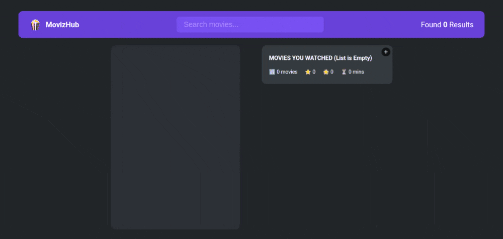

# MovizHub

MovizHub is a web-based application designed to provide a comprehensive movie browsing and management experience. The project includes features for exploring a movie database, viewing detailed movie information, rating films, and managing watched lists.

## Table of Contents

- [Features](#features)
- [Installation](#installation)
- [Demo](#demo)
- [Usage](#usage)
- [Project Structure](#project-structure)

## Features

- **Movie Browsing:** Explore a wide collection of movies with a responsive and user-friendly UI.
- **Movie Detail View:** Get detailed information about selected movies including ratings, posters, and descriptions.
- **Watched Movies List:** Manage and track movies you’ve watched.
- **Rating System:** Rate movies and see ratings displayed with interactive icons.
- **Responsive Design:** Enjoy a seamless experience on both desktop and mobile devices.

## Demo



The application is deployed on Netlify, you can try it out here 👉 [MovizHub](https://movizhub026.netlify.app/)

[](https://app.netlify.com/sites/movizhub026/deploys)

Also check out its 👉 [figma design](https://www.figma.com/design/VMPGB2johIg5qYy2MWXOwt/MovizHub?node-id=0-1&t=2OJgCZYVq5xp0RkO-1)

## Installation

### Prerequisites

- [Node.js](https://nodejs.org/) (version 12 or above)
- npm (comes with Node.js) or yarn

### Steps

1. **Clone the Repository:**

   ```bash
   git clone https://github.com/yourusername/MovizHub.git
   cd MovizHub
   ```

2. **Install Dependencies:**

   Using npm:

   ```bash
   npm install
   ```

   Or using yarn:

   ```bash
   yarn install
   ```

3. **Environment Setup:**

   The project require environment variables. Create a `.env` file and add the `OMDB API key`. Generate your OMDB API key [here](https://www.omdbapi.com/)

4. **Run the Application:**

   Using npm:

   ```bash
   npm start
   ```

   Or using yarn:

   ```bash
   yarn start
   ```

The app should now be running on `http://localhost:3000`

## Usage

- **Browse Movies:** Navigate to the homepage and search any movie.
- **View Details:** Click on any movie to see detailed information.
- **Rate & Track:** Use the rating component to rate movies and add to the watchlist.
- **Responsive Layout:** The app adapts seamlessly to different screen sizes.

## Project Structure

```bash
   MovizHub/
├── public/                  # Static assets and HTML files
│   └── assets/              # Images, icons, and other media assets
├── src/                     # Source code
│   ├── components/          # Reusable UI components (Header, MovieDetail, Rating, etc.)
│   ├── hooks/               # Custom React hooks (fetching data, local storage, etc.)
│   ├── index.js             # Entry point for the React application
│   └── index.css            # Global CSS styles
├── .env                     # Environment variables
├── .gitignore               # Files and directories to ignore in Git
├── package.json             # Project metadata and dependencies
└── README.md                # This file

```
